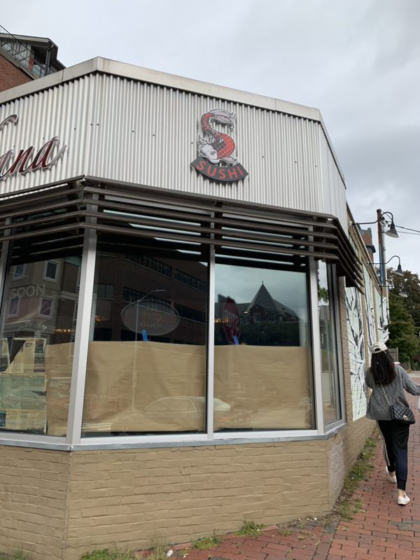

<html><body> 
<p> yurichen@umich.edu | 617-708-6889 | <a href="https://www.linkedin.com/in/yuri-chen-4b4ba61a3/"> LinkedIn </a> </p>
</body></html>
 

<!--Text can be **bold**, _italic_, or ~~strikethrough~~.

[Resume](./another-page.html).
-->

# My Projects and Artwork!

Here is some more about the projects I've done!

[Back to My Main Page](index.md)
<!--
## Header 2


 This is a blockquote following a header.
 When something is important enough, you do it even if the odds are not in your favor.
-->

<!--### Header 3

```js
 Javascript code with syntax highlighting.
var fun = function lang(l) {
  dateformat.i18n = require('./lang/' + l)
  return true;
}
```

```ruby
# Ruby code with syntax highlighting
GitHubPages::Dependencies.gems.each do |gem, version|
  s.add_dependency(gem, "= #{version}")
end
```
-->

<!--
##### Header 5

1.  This is an ordered list following a header.
2.  This is an ordered list following a header.
3.  This is an ordered list following a header.

###### Header 6

| head1        | head two          | three |
|:-------------|:------------------|:------|
| ok           | good swedish fish | nice  |
| out of stock | good and plenty   | nice  |
| ok           | good `oreos`      | hmm   |
| ok           | good `zoute` drop | yumm  |

### There's a horizontal rule below this.

* * *

### Here is an unordered list:

*   Item foo
*   Item bar
*   Item baz
*   Item zip

### And an ordered list:

1.  Item one
1.  Item two
1.  Item three
1.  Item four
-->

## Too Many Mines
- I made this game on Unity, which involves mines, score multipliers, and risk! The game plays with a 5x5 grid that contain either a 1,2,3, or a bomb. There are hint tiles on the sides that tell you how many bombs are in each row or column. Click the bomb and you'll lose. Click all the 2 and 3 multiplier tiles to proceed to the next level. After completing a level, continue on for higher scores, or stop and quit to save your score. <a href="https://chiis.itch.io/too-many-mines"> Try it out here!</a>


## Undergraduate Research Opportunity Program (UROP) - Zopf Lab
- I worked as a lab assistant, reasearching about Juvenile Nasopharyngeal Angiofibroma(JNA) tumor. I was tasked to create a realistic simulator to be used by surgeons for practice. I used Mimics and 3-matic software to create a Computer-Aided Design(CAD) model of the skull of someone with the JNA tumor. I also helped create the model of the tumor by using 3D printing to create molds of the tumor out of silicon. The skull, made out of bone, would made out of plastic 3D printing material, while the softer tissue tumor would be made from silicon to create a realistic simulation. <a href="https://github.com/yurichen17/yurichen17.github.io/blob/main/updated%20urop%20poster%202020%20(1).pdf" download="UROP-Yuri_Chen">Check out my research poster!</a>

## Illustration
- I drew illustrations for the book Attackment-Based Yoga & Meditation by Deidre Fay. Below are a few of the many drawings done for the book, which were done in Clip Studio Paint.
  
  
  

- I also drew the cover of Becoming Safely Embodied by Deidre Fay. Below is the cover I illustrated on Adobe Photoshop.
  
## Graphic Design
- I created the logo for a resturant in Cambridge, MA. The resturant's name is Sakana, and I had a lot of fun designing a final product for the client. Below, I show some drafts and the final logo design, after working and communicating with the client. I used Adobe Illustrator, and Adobe Photoshop for this project.
 
 
- Here are images of the logo being used on the resturant!
 
 

<!--
  
  - level 2 item
    - level 3 item
    - level 3 item
- level 1 item
  - level 2 item
  - level 2 item
  - level 2 item
- level 1 item
  - level 2 item
  - level 2 item
- level 1 item

### Small image


### Large image


### Definition lists can be used with HTML syntax.

<dl>
<dt>Name</dt>
<dd>Godzilla</dd>
<dt>Born</dt>
<dd>1952</dd>
<dt>Birthplace</dt>
<dd>Japan</dd>
<dt>Color</dt>
<dd>Green</dd>
</dl>

```
Long, single-line code blocks should not wrap. They should horizontally scroll if they are too long. This line should be long enough to demonstrate this.
```

```
The final element.
```
-->


